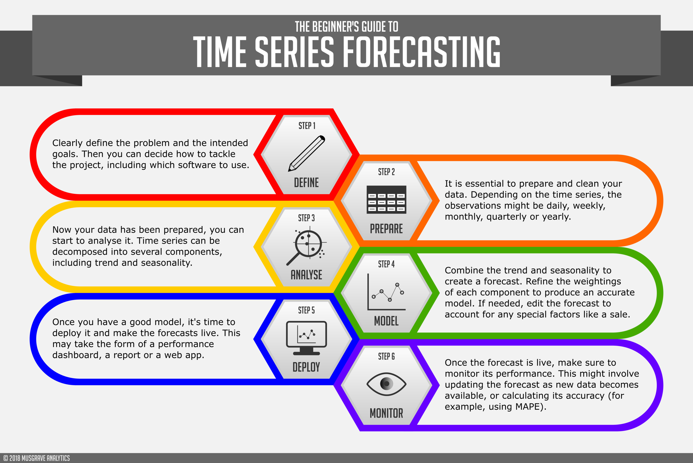

```{r setup, include=FALSE}
knitr::opts_chunk$set(echo = TRUE, warning = FALSE, message = FALSE, 
                      cache = TRUE, fig.width = 10, fig.height = 10)
```

# Getting Started ---

Learning objectives:

 - What is a forecast?
 
 - Forecasting: goals and planning
 
 - Forecasting data and methods
 
 - Case studies
 
 - Basic steps in a forecasting task

```{r echo = FALSE}
# suppressMessages(library(tidyverse))
# library(fpp3)
```

# Introduction ---

Consider the following famous predictions about computing.

  - *I think there is a world market for maybe five computers.* (Chairman of IBM, 1943)
  
  - *Computers in the future may weigh no more than 1.5 tons.* (Popular Mechanics, 1949)
  
  - *There is no reason anyone would want a computer in their home.* (President, DEC, 1977)

# 1.1 - What is a forecast? ---

{heigth=800px, width=600px}

# Which is easiest to forecast?

 1. daily electricity demand in 3 days time
 2. time of sunrise this day next year
 3. Google stock price tomorrow
 4. Google stock price in 6 months time
 5. maximum temperature tomorrow
 6. exchange rate of \$US/AUS next week
 7. total sales of drugs in Australian pharmacies next month
 8. timing of next Halley's comet appearance

# Possible answer

 2. time of sunrise this day next year
 8. timing of next Halley's comet appearance
 5. maximum temperature tomorrow
 1. daily electricity demand in 3 days time
 7. total sales of drugs in Australian pharmacies next month
 3. Google stock price tomorrow
 6. exchange rate of \$US/AUS next week
 4. Google stock price in 6 months time

# 

The predictability of an event or a quantity depends on several factors including:

 - how well we understand the factors that contribute to it;
 
 - how much data is available;
 
 - how similar the future is to the past;
 
 - whether the forecasts can affect the thing we are trying to forecast.

# 1.2 - Forecasting: goals and planning ---

*Forecasting*

is about predicting the future as accurately as possible, given all of the information available, including historical data and knowledge of any future events that might impact the forecasts.

*Goals*

are what you would like to have happen. Goals should be linked to forecasts and plans, but this does not always occur. Too often, goals are set without any plan for how to achieve them, and no forecasts for whether they are realistic.

*Planning*

is a response to forecasts and goals. Planning involves determining the appropriate actions that are required to make your forecasts match your goals.

# 1.3 - Determining what to forecast ---

Example: Forecasts are required for items in a manufacturing environment, it is necessary to ask whether forecasts are needed for:

 - every product line, or for groups of products?
 
 - every sales outlet, or for outlets grouped by region, or only for total sales?
 
 - weekly data, monthly data or annual data?
 
It is also necessary to consider the **forecasting horizon**.

 - Will forecasts be required for one month in advance, for 6 months, or for ten years?

# 1.4 - Forecasting data and methods ---

If there are no data available, or if the data available are not relevant to the forecasts, then **qualitative forecasting** methods must be used (see Chapter 6).

**Quantitative forecasting** can be applied when two conditions are satisfied:

 - numerical information about the past is available;
 
 - it is reasonable to assume that some aspects of the past patterns will continue into the future.

Examples of time series data include:

 - Annual Google profits
 
 - Weekly retail sales
 
 - 5-minute freeway traffic counts
 
 - Time-stamped stock transaction data

# 1.5 - Case Studies

The textbook presents four case studies as an example of types of forecasting situations and the associated challenges that often arises.

# 1.6 - Basic stepts in a forecasting task ---

{heigth=1000px, width=1000px}

# 1.7 - The statistical forecasting perspective ---

The thing we are trying to forecast is unknown (or we would not be forecasting it), and so we can think of it as a *random variable*. 

Example: Forecast of total sales for next month.

The values for the next month total sales could take a range of possible values, and until we add up the actual sales at the end of the month, we don’t know what the value will be. So until we know the sales for next month, it is a *random quantity*.

When we obtain a forecast, we are estimating the *middle* of the range of possible values the random variable could take. Often, a forecast is accompanied by a **prediction interval** giving a range of values the random variable could take with relatively high probability. For example, a 95% prediction interval contains a range of values which should include the actual future value with probability 95%.