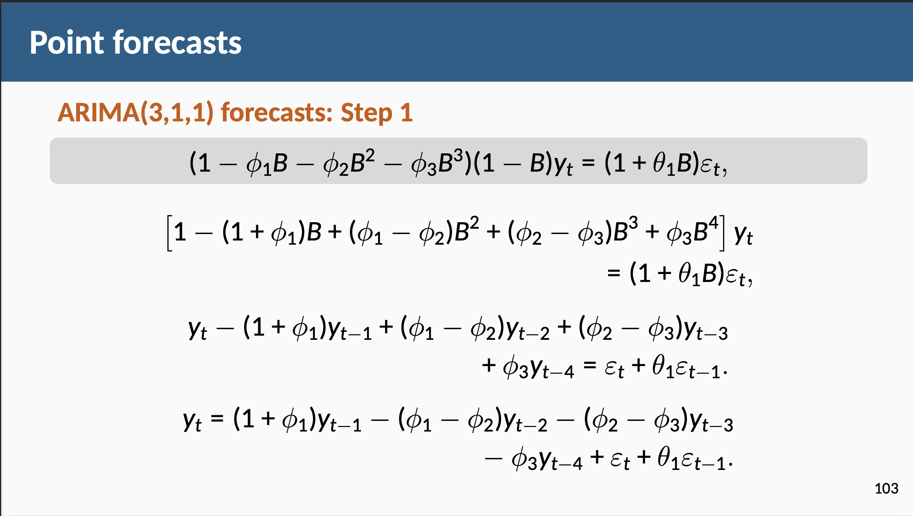
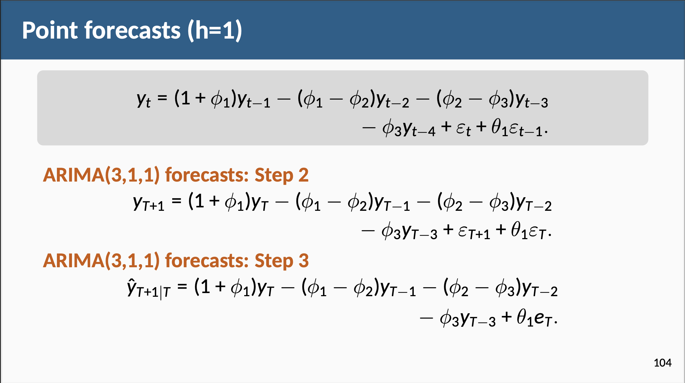
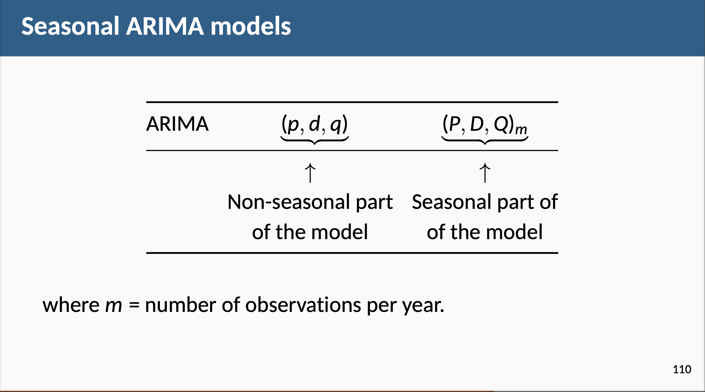
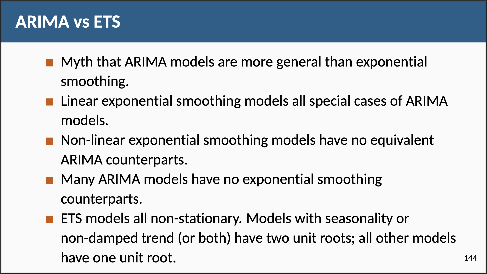
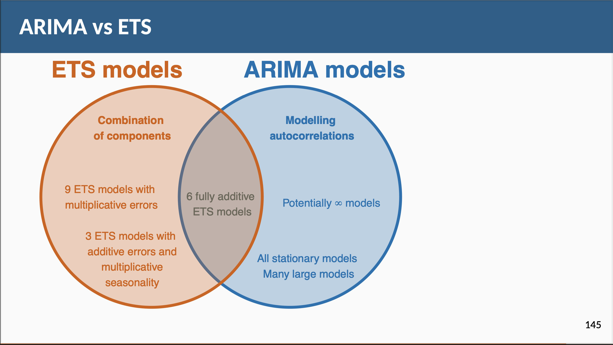
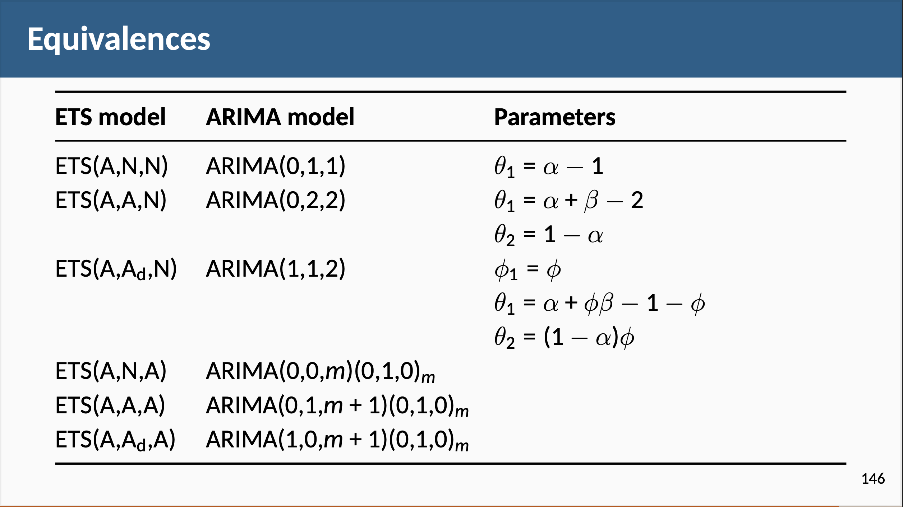

```{r setup, include=FALSE}
knitr::opts_chunk$set(echo = TRUE, warning = FALSE, message = FALSE, 
                      cache = TRUE, fig.width = 10, fig.height = 8)
```

# Learning objectives:

-   Hierarchical and grouped time series

-   Single level approaches

-   Forecast reconciliation

-   Forecasting Australian domestic tourism

-   Reconciled distributional forecasts

-   Forecasting Australian prison population

```{r echo = FALSE}
suppressMessages(library(tidyverse))
library(fpp3)
library(timetk)
library(plotly)
library(patchwork)
theme_set(theme_minimal())
```

# Introduction ---

-   Time series can be disaggregated based on attributes of interest, creating hierarchical time series with nested categories.

-   Hierarchical time series can arise from geographic divisions or attributes like product types.

-   Grouped time series occur when attributes of interest are crossed and not naturally nested.

-   Complex structures can arise when attributes are both nested and crossed.

-   Forecasts are needed for both disaggregate and aggregate series, and coherence is required in the forecasts across the entire aggregation structure.

This chapter discusses forecasting large collections of time series while maintaining coherence with the hierarchical or grouped aggregation structure.

# 11.1 - Hierarchical and grouped time series

Hierarchical time series

{height="1000px," width="800px"}

Example: Australian tourism hierarchy

Australia is divided into six states and two territories, with each one having its own government and some economic and administrative autonomy. For simplicity, we refer to both states and territories as “states”. Each of these states can be further subdivided into regions, for a total of 76 regions.

For simplicity sake, we'll recode `State` to use abbreviations.
```{r tourism-state}
tourism <- tsibble::tourism |>
     mutate(State = recode(State,
                           `New South Wales` = "NSW",
                           `Northern Territory` = "NT",
                           `Queensland` = "QLD",
                           `South Australia` = "SA",
                           `Tasmania` = "TAS",
                           `Victoria` = "VIC",
                           `Western Australia` = "WA"
     ))
```

Using the aggregate_key() function, we can create the hierarchical time series with overnight trips in regions at the bottom level of the hierarchy, aggregated to states, which are aggregated to the national total. A hierarchical time series corresponding to the nested structure is created using a parent/child specification.
```{r aggregated}
tourism_hts <- tourism |> 
     aggregate_key(State / Region, Trips = sum(Trips))

tourism_hts
```

The plot below shows he aggregate total overnight trips for the whole of Australia as well as the states, revealing diverse and rich dynamics.
```{r}
tourism_hts |>
     filter(is_aggregated(Region)) |>
     autoplot(Trips) +
     labs(y = "Trips ('000)",
          title = "Australian tourism: national and states") +
     facet_wrap(vars(State), scales = "free_y", ncol = 3) +
     theme(legend.position = "none")
```

Comment: There seems to be a significant jump for Western Australia in 2014.

#

Seasonal plots for overnight trips for Queensland and the Northern Territory, and Victoria and Tasmania highlighting the contrast in seasonal patterns between northern and southern states in Australia.
```{r}
tourism_hts |> 
     filter(State == "NT" | State == "QLD" |
         State == "TAS" | State == "VIC", 
         is_aggregated(Region)) |> 
     select(-Region) |> 
     mutate(State = factor(State, 
          levels=c("QLD","VIC","NT","TAS"))) |> 
     gg_season(Trips) + 
     facet_wrap(vars(State), nrow = 2, scales = "free_y") + 
     labs(y = "Trips ('000)")
```

## Grouped time series

{height="1000px," width="800px"}

Grouped time series can sometimes be thought of as hierarchical time series that do not impose a unique hierarchical structure, in the sense that the order by which the series can be grouped is not unique.

Example: Australian prison population

In this example we consider the Australia prison population data (see Chapter 2). The panels below show the prison population disaggregated or grouped by (a) state (b) legal status (whether prisoners have already been sentenced or are in remand waiting for a sentence), and (c) gender. The three factors are crossed, but none are nested within the others.
```{r}
prison <- read_csv("https://OTexts.com/fpp3/extrafiles/prison_population.csv") %>% 
     as_tibble()

prison
```

Plot time series aggregated to the top level (Australia)
```{r}
prison %>% 
     summarise_by_time(
          .date_var = Date, 
          .by = 'day', 
          value = sum(Count) / 1e3
     ) %>% 
     plot_time_series(
          .date_var = Date, 
          .value = value, 
          .x_lab = NULL, 
          .y_lab = 'Number of prisoners ("000s")', 
          .title = 'Australia Prison Population: Total'
     )
```

Plot time series by `gender`, `legal status`, and `state`
```{r}
prison_ts <- prison %>% 
     mutate(Quarter = yearquarter(Date)) |> 
     select(-Date)  |> 
     as_tsibble(key = c(Gender, Legal, State, Indigenous), 
                index = Quarter) |> 
     relocate(Quarter)

prison_gts <- prison_ts |> 
     aggregate_key(Gender * Legal * State, Count = sum(Count)/1e3)

p1 <- prison_gts |> 
     filter(!is_aggregated(Gender), is_aggregated(Legal), 
            is_aggregated(State)) |>
     autoplot(Count) +
     labs(y = "Number of prisoners ('000)", 
          title = 'Gender', 
          fill = 'Gender') + 
     theme(plot.title = element_text(hjust = 0.5))

p2 <- prison_gts |> 
     filter(is_aggregated(Gender), !is_aggregated(Legal), 
            is_aggregated(State)) |>
     autoplot(Count) +
     labs(y = "Number of prisoners ('000)", 
          title = 'Legal') + 
     theme(plot.title = element_text(hjust = 0.5))

p3 <- prison_gts |> 
     filter(is_aggregated(Gender), is_aggregated(Legal), 
            !is_aggregated(State)) |>
     autoplot(Count) +
     labs(y = "Number of prisoners ('000)", 
          title = 'State') + 
     theme(plot.title = element_text(hjust = 0.5))

p1 + p2 + p3 + plot_layout(guides = 'collect')
```

Plot time series for prison population by state and gender
```{r}
p4 <- prison_gts |>
     filter(!is_aggregated(Gender), !is_aggregated(Legal),
            !is_aggregated(State)) |>
     mutate(Gender = as.character(Gender)) |>
     ggplot(aes(x = Quarter, y = Count,
                group = Gender, colour = Gender)) +
     stat_summary(fun = sum, geom = "line") +
     labs(title = "Prison population by state and gender",
          y = "Number of prisoners ('000)") +
     facet_wrap(~ as.character(State),
                nrow = 1, scales = "free_y") +
     theme(axis.text.x = element_text(angle = 90, hjust = 1))
```

Plot time series for prison population by state and legal status
```{r}
p5 <- prison_gts |>
     filter(!is_aggregated(Gender), !is_aggregated(Legal),
            !is_aggregated(State)) |>
     mutate(Legal = as.character(Legal)) |>
     ggplot(aes(x = Quarter, y = Count,
                group = Legal, colour = Legal)) +
     stat_summary(fun = sum, geom = "line") +
     labs(title = "Prison population by state and legal status",
          y = "Number of prisoners ('000)", 
          colour = 'Legal Status') +
     facet_wrap(~ as.character(State),
                nrow = 1, scales = "free_y") +
     theme(axis.text.x = element_text(angle = 90, hjust = 1))
```

Plot time series for prison population by legal status and gender
```{r}
p6 <- prison_gts |>
     filter(!is_aggregated(Gender), !is_aggregated(Legal),
            !is_aggregated(State)) |>
     mutate(Gender = as.character(Gender)) |>
     ggplot(aes(x = Quarter, y = Count,
                group = Gender, colour = Gender)) +
     stat_summary(fun = sum, geom = "line") +
     labs(title = "Prison population by legal status and gender",
          y = "Number of prisoners ('000)") +
     facet_wrap(~ as.character(Legal),
                nrow = 1, scales = "free_y") +
     theme(axis.text.x = element_text(angle = 90, hjust = 1))

p4 / p5 / p6
```

```{r}
prison %>% 
     select(-Indigenous) %>% 
     unite(Legal_Gender, c('Legal', 'Gender'), sep = ' / ') %>% 
     group_by(Date, State, Legal_Gender) %>% 
     summarise(Count = sum(Count) / 1e3, .groups = 'drop') %>% 
     mutate(State = State %>% as.factor, 
            Legal_Gender = Legal_Gender %>% as.factor) %>% 
     
     # plot time series
     plot_time_series(
          .date_var = Date, 
          .value = Count, 
          .color_var = Legal_Gender, 
          .color_lab = 'Legal status & Gender', 
          .facet_vars = State, 
          .title = 'Australian prison population: bottom-level series',
          .smooth = FALSE, 
          .facet_nrow = 2, 
          .facet_ncol = 4
     )
```

Bottom-level time series for the Australian adult prison population, grouped by state, legal status and gender.

# 11.2 - Single level approaches

A very useful notational device is the backward shift operator, $B$, which is used as follows: $$
  B y_{t} = y_{t - 1}
$$\pause

In other words, $B$, operating on $y_{t}$, has the effect of **shifting the data back one period**. \pause

Two applications of $B$ to $y_{t}$ **shifts the data back two periods**: $$
  B(By_{t}) = B^{2}y_{t} = y_{t-2}
$$\pause

# 9.3 - Autoregressive models

In a multiple regression model, introduced in Chapter 7, we forecast the variable of interest using a linear combination of predictors. In an autoregression model, we forecast the variable of interest using a linear combination of *past values of the variable*. The term *auto*regression indicates that it is a regression of the variable **against itself**.

Thus, an autoregressive model of order p can be written as

```{=tex}
\begin{equation}
y_t=c+\phi_1 y_{t-1}+\phi_2 y_{t-2}+\cdots+\phi_p y_{t-p}+\varepsilon_t
\end{equation}
```

where $ε_t$ is white noise. This is like a multiple regression but with lagged values of $y_t$ as predictors. We refer to this as an AR($p$) model, an autoregressive model of order $p$.

For an AR(1) model:

-   When $\phi_1=0$, $y_t$ is **equivalent to WN**
-   When $\phi_1=1$ and $c=0$, $y_t$ is **equivalent to a RW**
-   When $\phi_1=1$ and $c\ne0$, $y_t$ is **equivalent to a RW with drift**
-   When $\phi_1<0$, $y_t$ tends to **oscillate between positive and negative values**.

# 9.4 - Moving average models

Rather than using past values of the forecast variable in a regression, a moving average model uses past forecast errors in a regression-like model, 

```{=tex}
\begin{equation}
y_t=c+\varepsilon_t+\theta_1 \varepsilon_{t-1}+\theta_2 \varepsilon_{t-2}+\cdots+\theta_q \varepsilon_{t-q}
\end{equation}
```

where $ε_t$ is white noise. We refer to this as an MA($q$) model, a moving average model of order $q$. Of course, we do not observe the values of $ε_t$, so it is not really a regression in the usual sense.

## Invertibility

-   Any MA($q$) process can be written as an AR($\infty$) process if we impose some constraints on the MA parameters.
-   Then the MA model is called "invertible".
-   Invertible models have some mathematical properties that make them easier to use in practice.
-   Invertibility of an ARIMA model is equivalent to forecastability of an ETS model.

# 9.5 - Non-seasonal ARIMA models

If we combine differencing with autoregression and a moving average model, we obtain a non-seasonal ARIMA model. ARIMA is an acronym for AutoRegressive Integrated Moving Average (in this context, "integration" is the reverse of differencing).

The full model can be written as :

```{=tex}
\begin{equation}
y_t^{\prime}=c+\phi_1 y_{t-1}^{\prime}+\cdots+\phi_p y_{t-p}^{\prime}+\theta_1 \varepsilon_{t-1}+\cdots+\theta_q \varepsilon_{t-q}+\varepsilon_t
\end{equation}
```

where $y′_t$ is the differenced series (it may have been differenced more than once). The “predictors” on the right hand side include both lagged values of $y_t$ and lagged errors.

#

Example: Egyptian exports

```{r}
global_economy |>
     filter(Code == "EGY") |>
     autoplot(Exports) +
     labs(y = "% of GDP", title = "Egyptian exports")
```

The following R code selects a non-seasonal ARIMA model automatically.
```{r}
fit <- global_economy |>
     filter(Code == "EGY") |>
     model(ARIMA(Exports))

report(fit)
```

Fitted model residual plots
```{r}
fit |> 
     gg_tsresiduals()
```

Forecast for 10 years (periods)
```{r}
fit |> forecast(h=10) |>
     autoplot(global_economy) +
     labs(y = "% of GDP", title = "Egyptian exports")
```

# ACF and PACF plots

It is usually not possible to tell, simply from a time plot, what values of $p$ and $q$ are appropriate for the data. However, it is sometimes possible to use the ACF plot, and the closely related PACF plot, to determine appropriate values for $p$ and $q$.

[Interpreting ACF and PACF Plots for Time Series Forecasting](https://towardsdatascience.com/interpreting-acf-and-pacf-plots-for-time-series-forecasting-af0d6db4061c)

```{r}
global_economy |>
     filter(Code == "EGY") |>
     gg_tsdisplay(Exports, plot_type = "partial")
```

We can detect a decaying sinusoidal pattern in the ACF, and the PACF shows the last significant spike at lag 4. This is what you would expect from an ARIMA(4,0,0) model.
```{r}
fit2 <- global_economy |>
     filter(Code == "EGY") |>
     model(ARIMA(Exports ~ pdq(4,0,0)))

report(fit2)
```

This model is only slightly worse than the ARIMA(2,0,1) model identified by `ARIMA()` (with an AICc value of 294.70 compared to 294.29).

# 9.7 - ARIMA modelling in `fable`

The `ARIMA()` function in the fable package uses a variation of the Hyndman-Khandakar algorithm ([Hyndman & Khandakar, 2008](https://otexts.com/fpp3/arima-r.html#ref-HK08)), which combines unit root tests, minimisation of the AICc and MLE to obtain an ARIMA model. The arguments to `ARIMA()` provide for many variations on the algorithm. What is described here is the default behaviour.

## Modelling procedure

When fitting an ARIMA model to a set of (non-seasonal) time series data, the following procedure provides a useful general approach.

{height="1600px, "   width="800px"}

## Portmanteau tests of residuals for ARIMA models

With ARIMA models, more accurate portmanteau tests are obtained if the degrees of freedom of the test statistic are adjusted to take account of the number of parameters in the model. Specifically, we use ℓ−$K$ degrees of freedom in the test, where $K$ is the number of AR and MA parameters in the model. So for the non-seasonal models, we have considered so far, $K$=$p$+$q$. The value of $K$ is passed to the `ljung_box` function via the argument `dof`, as shown in the example below.

#

Example: Central Africa Republic exports
```{r}
global_economy |>
     filter(Code == "CAF") |>
     autoplot(Exports) +
     labs(title="Central African Republic exports",
          y="% of GDP")
```

1.  The time plot shows some non-stationarity, with an overall decline. The improvement in 1994 was due to a new government which overthrew the military junta and had some initial success, before unrest caused further economic decline.

2.  There is no evidence of changing variance, so we will not do a Box-Cox transformation.

3.  To address the non-stationarity, we will take a first difference of the data. 
```{r}
global_economy |>
     filter(Code == "CAF") |>
     gg_tsdisplay(difference(Exports), plot_type='partial')
```

4.  The PACF shown in the above figure is suggestive of an AR(2) model; so an initial candidate model is an ARIMA(2,1,0). The ACF suggests an MA(3) model; so an alternative candidate is an ARIMA(0,1,3).

5.  We fit both an ARIMA(2,1,0) and an ARIMA(0,1,3) model along with two automated model selections, one using the default stepwise procedure, and one working harder to search a larger model space.
```{r}
caf_fit <- global_economy |>
     filter(Code == "CAF") |>
     model(arima210 = ARIMA(Exports ~ pdq(2,1,0)),
           arima013 = ARIMA(Exports ~ pdq(0,1,3)),
           stepwise = ARIMA(Exports),
           search = ARIMA(Exports, stepwise=FALSE))

caf_fit |> pivot_longer(!Country, names_to = "Model name",
                         values_to = "Orders")

caf_fit |> 
     glance() |> 
     arrange(AICc) |> 
     select(.model:BIC)
```

The four models have almost identical AICc values. Of the models fitted, the full search has found that an ARIMA(3,1,0) gives the lowest AICc value, closely followed by the ARIMA(2,1,0) and ARIMA(0,1,3) — the latter two being the models that we guessed from the ACF and PACF plots. The automated stepwise selection has identified an ARIMA(2,1,2) model, which has the highest AICc value of the four models.

ARIMA parameters for `search` model.
```{r}
caf_fit |> 
     tidy() |> 
     filter(.model == 'search')
```

6.  The ACF plot of the residuals from the ARIMA(3,1,0) model shows that all autocorrelations are within the threshold limits, indicating that the residuals are behaving like white noise.
```{r}
caf_fit |>
     select(search) |>
     gg_tsresiduals()
```

A portmanteau test (setting K=3) returns a large p-value, also suggesting that the residuals are white noise.
```{r}
caf_fit |> 
     augment() |> 
     filter(.model=='search') |>
     features(.innov, ljung_box, lag = 10, dof = 3)
```

Forecast for 5 years (periods)
```{r}
caf_fit |>
     forecast(h=5) |>
     filter(.model=='search') |>
     autoplot(global_economy)
```

Note that the mean forecasts look very similar to what we would get with a random walk (equivalent to an ARIMA(0,1,0)). The extra work to include AR and MA terms has made little difference to the point forecasts in this example, although the prediction intervals are much narrower than for a random walk model.

# 9.8 - Forecasting

Although we have calculated forecasts from the ARIMA models in our examples, we have not yet explained how they are obtained. Point forecasts can be calculated using the following three steps.

1.  Expand the ARIMA equation so that $y_{t}$ is on the left hand side and all other terms are on the right.

2.  Rewrite the equation by replacing $t$ with $T$ + $h$.

3.  On the right hand side of the equation, replace future observations with their forecasts, future errors with zero, and past errors with the corresponding residuals.

{height="1000px,"   width="800px"}

{height="1000px,"   width="800px"}

# 9.9 - Seasonal ARIMA models

So far, we have restricted our attention to non-seasonal data and non-seasonal ARIMA models. However, ARIMA models are also capable of modelling a wide range of seasonal data.

A seasonal ARIMA model is formed by including additional seasonal terms in the ARIMA models we have seen so far. It is written as follows:

{height="1000px,"  width="800px"}

# Example: Monthly US leisure and hospitality employment

We will describe seasonal ARIMA modelling using monthly US employment data for leisure and hospitality jobs from January 2001 to September 2019.
```{r}
leisure <- us_employment |>
     filter(Title == "Leisure and Hospitality",
            year(Month) > 2000) |>
     mutate(Employed = Employed/1000) |>
     select(Month, Employed)

leisure |> 
     autoplot(Employed) + 
     geom_smooth(method = 'loess', se = FALSE, color = 'steelblue') + 
     labs(title = "US employment: leisure and hospitality",
          y="Number of people (millions)")
```

The data are clearly non-stationary, with strong seasonality and a nonlinear trend, so we will first take a seasonal difference. The seasonally differenced data is shown below:
```{r}
leisure |>
     gg_tsdisplay(difference(Employed, 12),
                  plot_type='partial', lag=36) +
     labs(title="Seasonally differenced", y="")
```

These are also clearly non-stationary, so we take a further first difference.
```{r}
leisure |>
  gg_tsdisplay(Employed |> 
                    difference(12) |> 
                    difference(), 
               plot_type='partial', lag=36) +
  labs(title = "Double differenced", y="")
```

Let's try three ARIMA models from ACF/PACF/Auto ARIMA.
```{r}
fit <- leisure |>
     model(
          arima012011 = ARIMA(Employed ~ pdq(0,1,2) + PDQ(0,1,1)),
          arima210011 = ARIMA(Employed ~ pdq(2,1,0) + PDQ(0,1,1)),
          auto = ARIMA(Employed, stepwise = FALSE, approx = FALSE)
     )

fit |> 
     pivot_longer(everything(), 
                  names_to = "Model name", 
                  values_to = "Orders")

fit |> 
     glance() |> 
     arrange(AICc) |> 
     select(.model:BIC)
```

The three fitted models have similar AICc values, with the automatically selected model being a little better.

ARIMA parameters for `auto` model.
```{r}
fit |> 
     tidy() |> 
     filter(.model == 'auto')
```

Residuals plots
```{r}
fit |> 
     select(auto) |> 
     gg_tsresiduals(lag=36)
```

One small but significant spike (at lag 11) out of 36 is still consistent with white noise. To be sure, we use a Ljung-Box test, being careful to set the degrees of freedom to match the number of parameters in the model.
```{r}
fit |> 
     augment() |> 
     filter(.model == "auto") |> 
     features(.innov, ljung_box, lag=24, dof=4)
```

The large p-value (greater than 0.05) confims that the residuals are similar to white noise.

Forecast for next 36 months (periods)
```{r}
forecast(fit, h=36) |>
     filter(.model=='auto') |>
     autoplot(leisure) +
     labs(title = "US employment: leisure and hospitality",
          y="Number of people (millions)")
```

# 9.10 - ARIMA vs ETS

{height="1000px,"  width="800px"}

{height="1000px,"  width="800px"}

{height="1000px,"  width="800px"}

# Comparing `ARIMA()` and `ETS()` on non-seasonal data

We can use time series cross-validation to compare ARIMA and ETS models. Let’s consider the Australian population from the `global_economy` dataset.
```{r}
aus_economy <- global_economy |>
     filter(Code == "AUS") |>
     mutate(Population = Population/1e6)

aus_economy |>
     slice(-n()) |>
     stretch_tsibble(.init = 10) |>
     model(
          ETS(Population),
          ARIMA(Population)
     ) |>
     forecast(h = 1) |>
     accuracy(aus_economy) |>
     select(.model, RMSE:MAPE)
```

In this case the ETS model has higher accuracy on the cross-validated performance measures. Below we generate and plot forecasts for the next 5 years generated from an ETS model.
```{r}
aus_economy |>
     model(ETS(Population)) |>
     forecast(h = "5 years") |>
     autoplot(aus_economy |> filter(Year >= 2000)) +
     labs(title = "Australian population",
          y = "People (millions)")
```

# Comparing `ARIMA()` and `ETS()` on seasonal data

In this case we want to compare seasonal ARIMA and ETS models applied to the quarterly cement production data (from `aus_production`).
```{r}
cement <- aus_production |>
     select(Cement) |>
     filter_index("1988 Q1" ~ .)

train <- cement |> filter_index(. ~ "2007 Q4")
```

The output below shows the model selected and estimated by `ARIMA()`. The ARIMA model does well in capturing all the dynamics in the data as the residuals seem to be white noise.
```{r}
fit_arima <- train |> model(ARIMA(Cement))
report(fit_arima)
```

Residuals plots
```{r}
fit_arima |> 
     gg_tsresiduals(lag_max = 16)
```

```{r}
fit_arima |> 
     augment() |> 
     features(.innov, ljung_box, lag = 16, dof = 5)
```

The output below also shows the ETS model selected and estimated by `ETS()`. This model also does well in capturing all the dynamics in the data, as the residuals similarly appear to be white noise.
```{r}
fit_ets <- train |> model(ETS(Cement))
report(fit_ets)
```

```{r}
fit_ets |>
  gg_tsresiduals(lag_max = 16)
```

```{r}
fit_ets |> 
     augment() |> 
     features(.innov, ljung_box, lag = 16)
```

The output below evaluates the forecasting performance of the two competing models over the test set. In this case the ARIMA model seems to be the slightly more accurate model based on the test set RMSE, MAPE and MASE.
```{r}
# Generate forecasts and compare accuracy over the test set
bind_rows(
     fit_arima |> accuracy(),
     fit_ets |> accuracy(),
     fit_arima |> forecast(h = 10) |> accuracy(cement),
     fit_ets |> forecast(h = 10) |> accuracy(cement)
  ) |>
     select(-ME, -MPE, -ACF1)
```

Below we generate and plot forecasts from the ARIMA model for the next 3 years.
```{r}
cement |>
     model(ARIMA(Cement)) |>
     forecast(h="3 years") |>
     autoplot(cement) +
     labs(title = "Cement production in Australia",
          y = "Tonnes ('000)")
```
