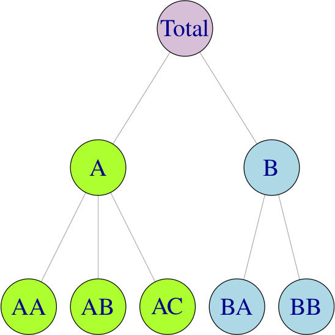
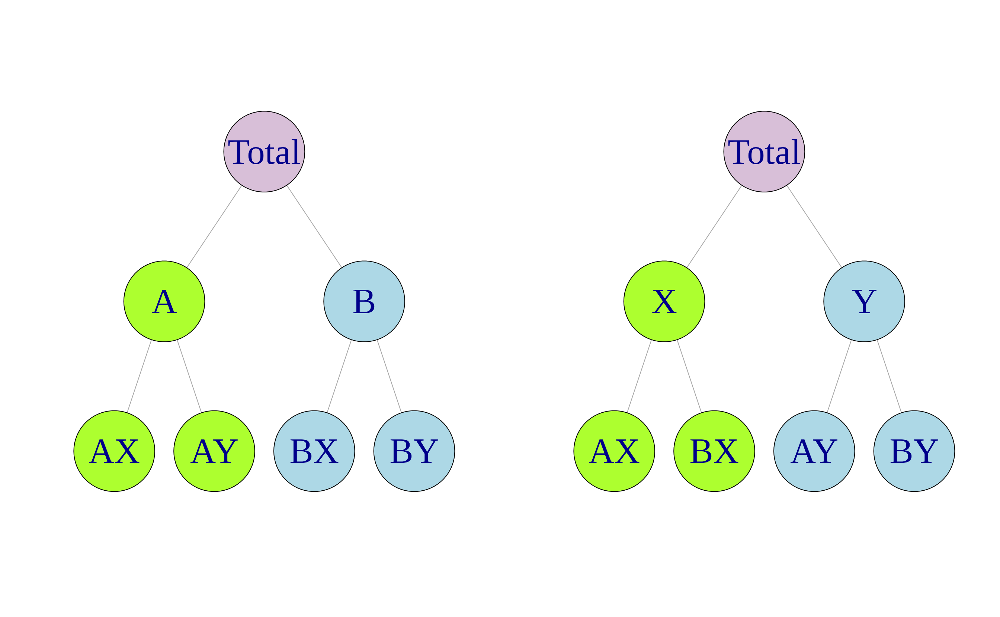

```{r setup, include=FALSE}
knitr::opts_chunk$set(echo = TRUE, warning = FALSE, message = FALSE, 
                      cache = TRUE, fig.width = 10, fig.height = 8)
```

# Learning objectives:

-   Hierarchical and grouped time series

-   Single level approaches

-   Forecast reconciliation

-   Forecasting Australian domestic tourism

-   Reconciled distributional forecasts

-   Forecasting Australian prison population

```{r echo = FALSE}
suppressMessages(library(tidyverse))
library(fpp3)
library(timetk)
library(plotly)
library(patchwork)
theme_set(theme_minimal())
```

# Introduction

-   Time series can be disaggregated based on attributes of interest, creating hierarchical time series with nested categories.

-   Hierarchical time series can arise from geographic divisions or attributes like product types.

-   Grouped time series occur when attributes of interest are crossed and not naturally nested.

-   Complex structures can arise when attributes are both nested and crossed.

-   Forecasts are needed for both disaggregate and aggregate series, and coherence is required in the forecasts across the entire aggregation structure.

This chapter discusses forecasting large collections of time series while maintaining coherence with the hierarchical or grouped aggregation structure.

# 11.1 - Hierarchical and grouped time series

Hierarchical time series

{height="1000px," width="800px"}

Example: Australian tourism hierarchy

Australia is divided into six states and two territories, with each one having its own government and some economic and administrative autonomy. For simplicity, we refer to both states and territories as "states". Each of these states can be further subdivided into regions, for a total of 76 regions.

For simplicity sake, we'll recode `State` to use abbreviations.

```{r tourism-state}
tourism <- tsibble::tourism |>
     mutate(State = recode(State,
                           `New South Wales` = "NSW",
                           `Northern Territory` = "NT",
                           `Queensland` = "QLD",
                           `South Australia` = "SA",
                           `Tasmania` = "TAS",
                           `Victoria` = "VIC",
                           `Western Australia` = "WA"
     ))
```

Using the `aggregate_key()` function, we can create the hierarchical time series with overnight trips in regions at the bottom level of the hierarchy, aggregated to states, which are aggregated to the national total. A hierarchical time series corresponding to the nested structure is created using a parent/child specification.

```{r aggregated}
tourism_hts <- tourism |> 
     aggregate_key(State / Region, Trips = sum(Trips))

tourism_hts
```

The plot below shows he aggregate total overnight trips for the whole of Australia as well as the states, revealing diverse and rich dynamics.

```{r}
tourism_hts |>
     filter(is_aggregated(Region)) |>
     autoplot(Trips) +
     labs(y = "Trips ('000)",
          title = "Australian tourism: national and states") +
     facet_wrap(vars(State), scales = "free_y", ncol = 3) +
     theme(legend.position = "none")
```

Comment: There seems to be a significant jump for Western Australia in 2014.

# 

Seasonal plots for overnight trips for Queensland and the Northern Territory, and Victoria and Tasmania highlighting the contrast in seasonal patterns between northern and southern states in Australia.

```{r}
tourism_hts |> 
     filter(State == "NT" | State == "QLD" |
         State == "TAS" | State == "VIC", 
         is_aggregated(Region)) |> 
     select(-Region) |> 
     mutate(State = factor(State, 
          levels=c("QLD","VIC","NT","TAS"))) |> 
     gg_season(Trips) + 
     facet_wrap(vars(State), nrow = 2, scales = "free_y") + 
     labs(y = "Trips ('000)")
```

## Grouped time series

{height="1000px," width="800px"}

Grouped time series can sometimes be thought of as hierarchical time series that do not impose a unique hierarchical structure, in the sense that the order by which the series can be grouped is not unique.

Example: Australian prison population

In this example we consider the Australia prison population data (see Chapter 2). The panels below show the prison population disaggregated or grouped by (a) state (b) legal status (whether prisoners have already been sentenced or are in remand waiting for a sentence), and (c) gender. The three factors are crossed, but none are nested within the others.

```{r}
prison <- read_csv("https://OTexts.com/fpp3/extrafiles/prison_population.csv") %>% 
     as_tibble()

prison
```

Plot time series aggregated to the top level (Australia)

```{r}
prison %>% 
     summarise_by_time(
          .date_var = Date, 
          .by = 'day', 
          value = sum(Count) / 1e3
     ) %>% 
     plot_time_series(
          .date_var = Date, 
          .value = value, 
          .x_lab = NULL, 
          .y_lab = 'Number of prisoners ("000s")', 
          .title = 'Australia Prison Population: Total'
     )
```

Plot time series by `gender`, `legal status`, and `state`

```{r}
prison_ts <- prison %>% 
     mutate(Quarter = yearquarter(Date)) |> 
     select(-Date)  |> 
     as_tsibble(key = c(Gender, Legal, State, Indigenous), 
                index = Quarter) |> 
     relocate(Quarter)

prison_gts <- prison_ts |> 
     aggregate_key(Gender * Legal * State, Count = sum(Count)/1e3)

p1 <- prison_gts |> 
     filter(!is_aggregated(Gender), is_aggregated(Legal), 
            is_aggregated(State)) |>
     autoplot(Count) +
     labs(y = "Number of prisoners ('000)", 
          title = 'Gender', 
          fill = 'Gender') + 
     theme(plot.title = element_text(hjust = 0.5))

p2 <- prison_gts |> 
     filter(is_aggregated(Gender), !is_aggregated(Legal), 
            is_aggregated(State)) |>
     autoplot(Count) +
     labs(y = "Number of prisoners ('000)", 
          title = 'Legal') + 
     theme(plot.title = element_text(hjust = 0.5))

p3 <- prison_gts |> 
     filter(is_aggregated(Gender), is_aggregated(Legal), 
            !is_aggregated(State)) |>
     autoplot(Count) +
     labs(y = "Number of prisoners ('000)", 
          title = 'State') + 
     theme(plot.title = element_text(hjust = 0.5))

p1 + p2 + p3 + plot_layout(guides = 'collect')
```

Plot time series for prison population by state and gender

```{r}
p4 <- prison_gts |>
     filter(!is_aggregated(Gender), !is_aggregated(Legal),
            !is_aggregated(State)) |>
     mutate(Gender = as.character(Gender)) |>
     ggplot(aes(x = Quarter, y = Count,
                group = Gender, colour = Gender)) +
     stat_summary(fun = sum, geom = "line") +
     labs(title = "Prison population by state and gender",
          y = "Number of prisoners ('000)") +
     facet_wrap(~ as.character(State),
                nrow = 1, scales = "free_y") +
     theme(axis.text.x = element_text(angle = 90, hjust = 1))
```

Plot time series for prison population by state and legal status

```{r}
p5 <- prison_gts |>
     filter(!is_aggregated(Gender), !is_aggregated(Legal),
            !is_aggregated(State)) |>
     mutate(Legal = as.character(Legal)) |>
     ggplot(aes(x = Quarter, y = Count,
                group = Legal, colour = Legal)) +
     stat_summary(fun = sum, geom = "line") +
     labs(title = "Prison population by state and legal status",
          y = "Number of prisoners ('000)", 
          colour = 'Legal Status') +
     facet_wrap(~ as.character(State),
                nrow = 1, scales = "free_y") +
     theme(axis.text.x = element_text(angle = 90, hjust = 1))
```

Plot time series for prison population by legal status and gender

```{r}
p6 <- prison_gts |>
     filter(!is_aggregated(Gender), !is_aggregated(Legal),
            !is_aggregated(State)) |>
     mutate(Gender = as.character(Gender)) |>
     ggplot(aes(x = Quarter, y = Count,
                group = Gender, colour = Gender)) +
     stat_summary(fun = sum, geom = "line") +
     labs(title = "Prison population by legal status and gender",
          y = "Number of prisoners ('000)") +
     facet_wrap(~ as.character(Legal),
                nrow = 1, scales = "free_y") +
     theme(axis.text.x = element_text(angle = 90, hjust = 1))

p4 / p5 / p6
```

```{r}
prison %>% 
     select(-Indigenous) %>% 
     unite(Legal_Gender, c('Legal', 'Gender'), sep = ' / ') %>% 
     group_by(Date, State, Legal_Gender) %>% 
     summarise(Count = sum(Count) / 1e3, .groups = 'drop') %>% 
     mutate(State = State %>% as.factor, 
            Legal_Gender = Legal_Gender %>% as.factor) %>% 
     
     # plot time series
     plot_time_series(
          .date_var = Date, 
          .value = Count, 
          .color_var = Legal_Gender, 
          .color_lab = 'Legal status & Gender', 
          .facet_vars = State, 
          .title = 'Australian prison population: bottom-level series',
          .smooth = FALSE, 
          .facet_nrow = 2, 
          .facet_ncol = 4
     )
```

Bottom-level time series for the Australian adult prison population, grouped by state, legal status and gender.

# 11.2 - Single level approaches

Traditionally, forecasts of hierarchical or grouped time series involved selecting one level of aggregation and generating forecasts for that level.

These are then either aggregated for higher levels, or disaggregated for lower levels, to obtain a set of coherent forecasts for the rest of the structure.

## The bottom-up approach

A simple method for generating coherent forecasts is the "bottom-up" approach. This approach involves first generating forecasts for each series at the bottom level, and then summing these to produce forecasts for all the series in the structure.

An advantage of this approach is that we are forecasting at the bottom level of a structure, and therefore no information is lost due to aggregation. On the other hand, bottom-level data can be quite noisy and more challenging to model and forecast.

Example: Generating bottom-up forecasts

Suppose we want national and state forecasts for the Australian tourism data. Let's create a simple `tsibble` object containing only state and national trip totals for each quarter.

```{r}
tourism_states <- tourism |> 
     aggregate_key(State, Trips = sum(Trips))
```

We could generate the bottom-level state forecasts first, and then sum them to obtain the national forecasts.

```{r}
fcasts_state <- tourism_states |>
     filter(!is_aggregated(State)) |>
     model(ets = ETS(Trips)) |>
     forecast()

# Sum bottom-level forecasts to get top-level forecasts
fcasts_national <- fcasts_state |> 
     summarise(value = sum(Trips), .mean = mean(value))

fcasts_national %>% 
     autoplot()
```

However, we want a more general approach that will work with all the forecasting methods discussed in this chapter. So we will use the `reconcile()` function to specify how we want to compute coherent forecasts.

```{r}
fcasts_states <- tourism_states |>
     model(ets = ETS(Trips)) |>
     reconcile(bu = bottom_up(ets)) |>
     forecast()

fcasts_states %>% 
     autoplot()
```

The `reconcile()` step has created a new "model" to produce bottom-up forecasts.

The `fable` object contains the `ets` forecasts as well as the coherent `bu` forecasts, for the 8 states and the national aggregate.

For bottom-up forecasting, this is rather inefficient as we are not interested in the ETS model for the national total, and the resulting `fable` contains a lot of duplicates. But later we will introduce more advanced methods where we will need models for all levels of aggregation, and where the coherent forecasts are different from any of the original forecasts.

## Top-down approaches

The top-down approach involves forecasting the top level of the hierarchy, and then splitting the forecast into the more granular series. Most commonly, historical proportions are used for determining the split.

Advantages:

```         
-  the simplest approach,

-  reliable forecast for the higher level(s) of the hierarchy,

-  only a single forecast is required.
```

Disadvantages:

```         
-  less accurate forecasts at the lower levels due to loss of information (via historical proportions).
```

[Source: Introduction to Hierarchical Time Series Forecasting --- Part I](https://towardsdatascience.com/introduction-to-hierarchical-time-series-forecasting-part-i-88a116f2e2)

## Middle-out approach

The middle-out approach combines bottom-up and top-down approaches. Again, it can only be used for strictly hierarchical aggregation structures.

In this approach, we select the middle level and forecast it directly. Then, for all the levels above the selected level, we use the bottom-up approach — we sum the levels up the hierarchy. For the levels below the middle one, we use the top-down approach.

# 11.3 - Forecasting reconciliation

In summary, unlike any other existing approach, the optimal reconciliation forecasts are generated using all the information available within a hierarchical or a grouped structure. This is important, as particular aggregation levels or groupings may reveal features of the data that are of interest to the user and are important to be modelled. These features may be completely hidden or not easily identifiable at other levels.

A detailed explanation for optimal forecast reconciliation can be found in this article [Optimal Forecast Reconciliation for Hierarchical Time Series](https://towardsdatascience.com/optimal-forecast-reconciliation-for-hierarchical-time-series-ea892ca105a9)

# 11.4 - Forecasting Australian domestic tourism

To compute forecasts for the Australian tourism data, we'll use the data up to the end of 2015 as the training set, witholding the final two years (eight quarters - periods) as the test set.

The code below demonstrates the full workflow for generating coherent forecasts using the bottom-up, OLS and MinT methods.
```{r}
tourism_full <- tourism |> 
     aggregate_key((State/Region) * Purpose, Trips = sum(Trips))

fit <- tourism_full |>
     filter(year(Quarter) <= 2015) |>
     model(base = ETS(Trips)) |>
     reconcile(
          bu = bottom_up(base),
          ols = min_trace(base, method = "ols"),
          mint = min_trace(base, method = "mint_shrink")
     )
```

`fit` contains the `base` ETS model for each series in `tourism_full`,m along with the three methods for producing coherent forecasts as specified in the `reconcile()` function.

Generate the forecasts
```{r}
fc <- fit |> forecast(h = "2 years")
```

Let's plot the four point forecasts for the overnight trips for the Australian total, the states, and the purposes of travel, along with the actual observations of the test set.
```{r}
fc |>
     filter(is_aggregated(Region), is_aggregated(Purpose)) |>
     autoplot(
          tourism_full |> filter(year(Quarter) >= 2011),
          level = NULL
     ) +
     labs(y = "Trips ('000)", 
          title = 'Forecasts of overnight trips for Australia and its states over the test period 2016Q1–2017Q4') +
     facet_wrap(vars(State), scales = "free_y")
```

```{r}
fc |>
     filter(is_aggregated(State), !is_aggregated(Purpose)) |>
     autoplot(
          tourism_full |> filter(year(Quarter) >= 2011),
          level = NULL
     ) +
     labs(y = "Trips ('000)", 
          title = 'Forecasts of overnight trips by purpose of travel over the test period 2016Q1–2017Q4. ') +
     facet_wrap(vars(Purpose), scales = "free_y")
```

In most panels, the increase in overnight trips, especially in the second half of the test set, is higher than what is predicted by the point forecasts. This is particularly noticeable for the mainland eastern states of ACT, New South Wales, Queensland and Victoria, and across all purposes of travel.

The following code generates the accuracy measures for the aggregate series shown in the first row of the table. Similar code is used to evaluate forecasts for other levels.
```{r}
fc |>
     filter(is_aggregated(State), is_aggregated(Purpose)) |>
     accuracy(
          data = tourism_full,
          measures = list(rmse = RMSE, mase = MASE)
     ) |>
     group_by(.model) |>
     summarise(rmse = mean(rmse), mase = mean(mase))
```

Reconciling the base forecasts using OLS and MinT results in more accurate forecasts compared to the bottom-up approach.

# 11.5 - Reconciled distributional forecasts

So far we have only discussed the reconciliation of point forecasts. However, we are usually also interested in the forecast distributions so that we can compute prediction intervals.

There are two fundamental results that are implemented in the `reconcile()`  function.

1.  If the base forecasts are normally distributed, then he reconciled forecasts are also normally distributed.

2.  f it is unreasonable to assume normality for the base forecasts, we can use bootstrapping. To generate bootstrapped prediction intervals in this way, we simply set `bootstrap = TRUE` in the `forecast()` function.

# 11.6 - Forecasting Australian prison population

Returning to the Australian prison population data (Section 11.1), we will compare the forecasts from bottom-up and MinT methods applied to base ETS models, using a test set comprising the final two years or eight quarters 2015Q1–2016Q4 of the available data.

Forecasts for the total Australian quarterly adult prison population for the period 2015Q1–2016Q4. 
```{r}
fit <- prison_gts |>
     filter(year(Quarter) <= 2014) |>
     model(base = ETS(Count)) |>
     reconcile(
          bottom_up = bottom_up(base),
          MinT = min_trace(base, method = "mint_shrink")
     )

fc <- fit |> forecast(h = 8)

fc |>
     filter(is_aggregated(State), is_aggregated(Gender),
            is_aggregated(Legal)) |>
     autoplot(prison_gts, alpha = 0.7, level = 90) +
     labs(y = "Number of prisoners ('000)",
          title = "Australian prison population (total)")
```

The figure above shows the three sets of forecasts for the aggregate Australian prison population. The base and bottom-up forecasts from the ETS models seem to underestimate the trend over the test period. The MinT approach combines information from all the base forecasts in the aggregation structure; in this case, the base forecasts at the top level are adjusted upward.

The following figures show the MinT and base forecasts at various levels of aggregation.

In general, MinT adjusts the base forecasts in the direction of the test set, hence improving the forecast accuracy. 

However, there is no guarantee that MinT reconciled forecasts will be more accurate than the base forecasts for every series, but they will be more accurate on average (see Panagiotelis et al., 2021).

Forecasts for the Australian quarterly adult prison population, disaggregated by state.
```{r}
fc |>
     filter(
          .model %in% c("base", "MinT"),
          !is_aggregated(State), is_aggregated(Legal),
          is_aggregated(Gender)
     ) |>
     autoplot(
          prison_gts |> filter(year(Quarter) >= 2010),
          alpha = 0.7, level = 90
     ) +
     labs(title = "Prison population (by state)",
          y = "Number of prisoners ('000)") +
     facet_wrap(vars(State), scales = "free_y", ncol = 4) +
     theme(axis.text.x = element_text(angle = 90, hjust = 1))
```

The figure above shows forecasts for each of the eight states. There is a general upward trend during the test set period across all the states.

However, there appears to be a relatively large and sudden surge in New South Wales and Tasmania, which means the test set observations are well outside the upper bound of the forecast intervals for both these states. Because New South Wales is the state with the largest prison population, this surge will have a substantial impact on the total.

Using the `accuracy()` function, we evaluate the forecast accuracy across the grouped structure.
```{r}
fc |>
     filter(is_aggregated(State), is_aggregated(Gender),
            is_aggregated(Legal)) |>
     accuracy(data = prison_gts,
              measures = list(mase = MASE,
                              ss = skill_score(CRPS)
              )
     ) |>
     group_by(.model) |>
     summarise(mase = mean(mase), sspc = mean(ss) * 100)
```

In conclusion, the results show that the MinT reconciled forecasts improve on the accuracy of the base forecasts and are also more accurate than the bottom-up forecasts.

As the MinT optimal reconciliation approach uses information from all levels in the structure, it generates more accurate forecasts than the traditional approaches (such as bottom-up) which use limited information.
