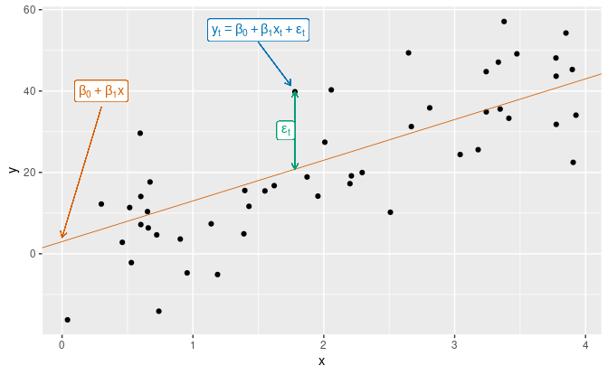

```{r setup, include=FALSE}
knitr::opts_chunk$set(echo = TRUE, warning = FALSE, message = FALSE, 
                      cache = TRUE, fig.width = 10, fig.height = 8)
```

# Time Series features ---

Learning objectives:

-   Develop linear models with time series.

-   Developing useful predictors for linear models.

-   Residual diagnostics.

-   Selecting predictors and forecast evaluation.

-   Forecasting with regression.

-   Matrix formulation

-   Correlation, causation and forecasting.

```{r echo = FALSE}
suppressMessages(library(tidyverse))
library(fpp3)
theme_set(theme_minimal())
```

# Introduction ---

In this chapter, we will discuss regression models. The basic concept is that we forecast the time series of interest $y$ assuming that is has a linear relationship with other time series $x$.

# 7.1 - The linear model ---

In the simplest case, the regression model allows for a linear relationship between the forecast variable $y$ and a single predictor $x$:

```{=tex}
\begin{block}{}\vspace*{-0.3cm}
\[
  y_t = \beta_0 + \beta_1 x_{1,t} + \varepsilon_t
\]
\end{block}
```

{heigth="800px," width="1000px"}

## Example: US consumption expenditure

Let's plot the time series of quarterly changes (growth rates) of real personal consumption expenditure ($y$) and real personal disposable income ($x$) for the U.S. from 1970 Q1 and 2019 Q2.

```{r}
data("us_change")
us_change
```

#

```{r}
us_change %>% 
     pivot_longer(c(Consumption, Income), 
                  names_to = 'Series') %>% 
     autoplot(value) + 
     labs(y = '% change')
```

#

Using the `lm` base function to calculate intercept and slope coefficients.

```{r}
us_chg_tbl <- us_change %>% 
     as_tibble() %>% 
     select(Consumption, Income)

model_lm <- lm(Consumption ~ Income, data = us_chg_tbl)
summary(model_lm)
```

#

Scatterplot with fitted regression line.

```{r}
us_change |>
     ggplot(aes(x = Income, y = Consumption)) +
     labs(y = "Consumption (quarterly % change)",
          x = "Income (quarterly % change)") +
     geom_point() +
     geom_smooth(method = "lm", se = FALSE)
```

#

Cross-correlation between the two time series.

```{r}
# base R
ccf(us_chg_tbl$Consumption, us_chg_tbl$Income)
```

```{r}
us_change %>% 
     CCF(Consumption, Income) %>% 
     autoplot()
```

The cross correlation plot can be used to determine lags as useful predictors.

# Mutiple regression

```{=tex}
\begin{block}{}\vspace*{-0.3cm}
\[
  y_t = \beta_0 + \beta_1 x_{1,t} + \beta_2 x_{2,t} + \cdots + \beta_kx_{k,t} + \varepsilon_t
\]
\end{block}
```
```{r}
us_change |> 
     
     # drop `Consumption`, `Income` columns
     select(-Consumption, -Income) |>
     pivot_longer(-Quarter) |>
     ggplot(aes(Quarter, value, colour = name)) +
     geom_line() +
     facet_grid(name ~ ., scales = "free_y") +
     guides(colour = "none") +
     labs(y="% change")
```

#

Pair plots for `us_change`

```{r}
library(GGally)
us_change %>% 
     ggpairs(columns = 2:6, 
             lower = list(
                  continuous = wrap('smooth', 
                                    color = 'steelblue', 
                                    alpha = 0.3, 
                                    size = 0.3)
                  )
             )
```

# Assumptions about the errors (residuals)

-   They have mean zero; otherwise the forecasts will be systematically *biased*.

-   They are not autocorrelated; otherwise the forecasts will be inefficient, as there is more information in the data that can be exploited.

-   They are *unrelated* to the predictor variables; otherwise there would be more information that should be included in the systematic part of the model.

-   The residuals follow a Gaussian distribution (normal) with a constant variance ($\sigma$\^2)

# 7.2 - Least squares estimation ---

The least squares principle provides a way of choosing the coefficients effectively by minimising the sum of the squared errors.

```{=tex}
\begin{block}{}\vspace*{-0.3cm}
\[
  \sum_{t=1}^T \varepsilon_t^2 = \sum_{t=1}^T (y_t -
  \beta_{0} - \beta_{1} x_{1,t} - \beta_{2} x_{2,t} - \cdots - \beta_{k} x_{k,t})^2
\]
\end{block}
```

# Example: US consupmtion expenditure

```{r}
fit_consMR <- us_change |>
     model(tslm = TSLM(Consumption ~ Income + Production +
                                    Unemployment + Savings))
report(fit_consMR)
```

# Fitted values

```{r}
augment(fit_consMR) |>
     ggplot(aes(x = Quarter)) +
     geom_line(aes(y = Consumption, colour = "Data")) +
     geom_line(aes(y = .fitted, colour = "Fitted")) +
     labs(y = NULL,
          title = "Percent change in US consumption expenditure"
     ) +
     scale_colour_manual(values=c(Data="black",Fitted="#D55E00")) +
     guides(colour = guide_legend(title = NULL))
```

# 

```{r}
augment(fit_consMR) |>
     ggplot(aes(x = Consumption, y = .fitted)) +
     geom_point() +
     labs(
          y = "Fitted (predicted values)",
          x = "Data (actual values)",
          title = "Percent change in US consumption expenditure"
     ) +
     geom_abline(intercept = 0, slope = 1, color = 'red')
```

# Goodness-of-fit

A common way to summarise how well a linear regression model fits the data is via the coefficient of determination, or $R$\^2. For the example above, the $R$\^2 = 0.768.

# 7.3 - Evaluating the regression model

Residual plots

Using the `gg_tsresiduals()` function introduced in Section 5.3, we can obtain all the useful residual diagnostics mentioned above.

```{r}
fit_consMR %>% 
     gg_tsresiduals()
```

```{r}
augment(fit_consMR) |> 
     features(.innov, ljung_box, lag = 10)
```

The time plot shows some changing variation over time, but is otherwise relatively unremarkable. This heteroscedasticity will potentially make the prediction interval coverage inaccurate.

The histogram shows that the residuals seem to be slightly skewed, which may also affect the coverage probability of the prediction intervals.

The autocorrelation plot shows a significant spike at lag 7, and a significant Ljung-Box test at the 5% level. However, the autocorrelation is not particularly large, and at lag 7 it is unlikely to have any noticeable impact on the forecasts or the prediction intervals.

# Residual plot against predictors

The residuals from the multiple regression model for forecasting US consumption plotted against each predictor in Figure 7.9 seem to be randomly scattered. Therefore we are satisfied with these in this case.

```{r}
us_change |>
     left_join(residuals(fit_consMR), by = "Quarter") |>
     pivot_longer(Income:Unemployment,
                  names_to = "regressor", values_to = "x") |>
     ggplot(aes(x = x, y = .resid)) +
     geom_point() +
     facet_wrap(. ~ regressor, scales = "free_x") +
     labs(y = "Residuals", x = "")
```

# Residual plots against fitted values

A plot of the residuals against the fitted values should also show no pattern. If a pattern is observed, there may be “heteroscedasticity” in the errors which means that the variance of the residuals may not be constant.

```{r}
augment(fit_consMR) |>
     ggplot(aes(x = .fitted, y = .resid)) +
     geom_point() + labs(x = "Fitted", y = "Residuals")
```

# Outliers and influential observations

Observations that take extreme values compared to the majority of the data are called outliers. Observations that have a large influence on the estimated coefficients of a regression model are called influential observations. Usually, influential observations are also outliers that are extreme in the $x$ direction.

# Spurious regressions

[Spurious correlations](https://tylervigen.com/spurious-correlations)
