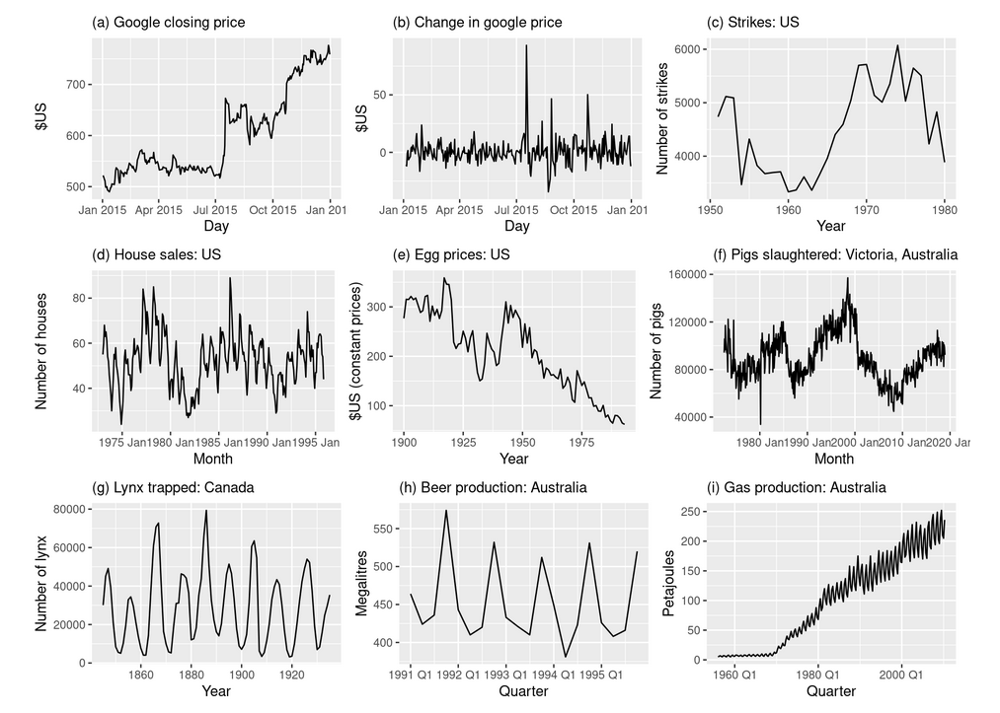
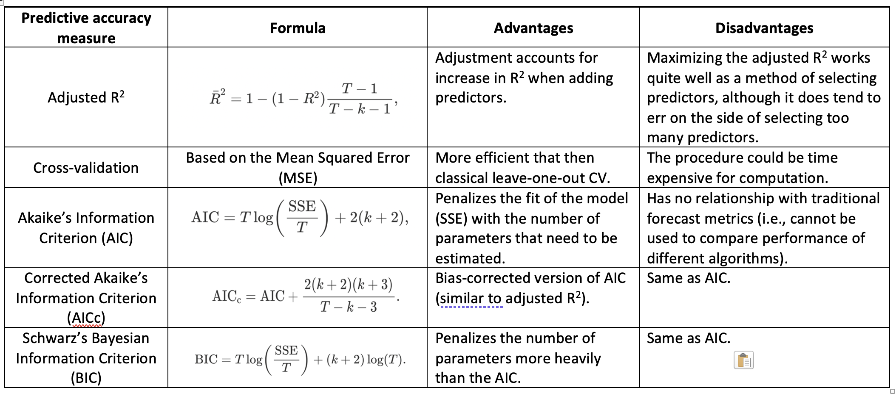
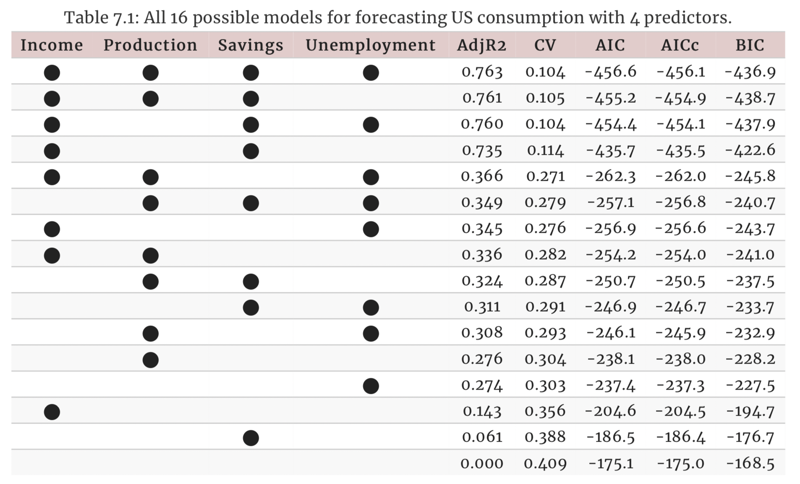

```{r setup, include=FALSE}
knitr::opts_chunk$set(echo = TRUE, warning = FALSE, message = FALSE, 
                      cache = TRUE, fig.width = 10, fig.height = 8)
```

# ARIMA models ---

Learning objectives:

-   Stationarity and differencing

-   Non-seasonal ARIMA models

-   Estimation and order selection

-   ARIMA modeling in R

-   Forecasting

-   Seasonal ARIMA models

-   ARIMA vs ETS

```{r echo = FALSE}
suppressMessages(library(tidyverse))
library(fpp3)
library(plotly)
theme_set(theme_minimal())
```

# Introduction ---

ARIMA models provide another approach to time series forecasting. While exponential smoothing models are based on a description of the trend and seasonality in the data, ARIMA models aim to describe the autocorrelations in the data.

# 9.1 - Stationarity and differencing ---

A stationary time series is one whose statistical properties do not depend on the time at which the series is observed.

Thus, a stationary time series exhibits the following characteristics:

-   Roughly horizontal (no trend)

-   Constant variance

-   No long-term predictable patterns

#

{heigth="1000px," width="800px"}

# Differencing

In Figure 9.1, note that the Google stock price was non-stationary in panel (a), but the daily changes were stationary in panel (b). This shows one way to make a non-stationary time series stationary — compute the differences between consecutive observations. This is known as **differencing**.

```{r google_stock_price}
google_2015 <- gafa_stock |>
  filter(Symbol == "GOOG", year(Date) == 2015)

google_2015 |> ACF(Close) |>
  autoplot() + labs(subtitle = "Google closing stock price")

google_2015 |> ACF(difference(Close)) |>
  autoplot() + labs(subtitle = "Changes in Google closing stock price")
```

```{r ljung_box_test}
google_2015 |>
  mutate(diff_close = difference(Close)) |>
  features(diff_close, ljung_box, lag = 10)
```

# Random walk model ----

A time series is said to follow a random walk process if the predicted value of the series in one period is equivalent to the value of the series in the previous period plus a random error. Source: https://analystprep.com/study-notes/cfa-level-2/random-walk-process/

If differenced series is white noise with zero mean:

\begin{block}{}
\centerline{$y_t-y_{t-1}=\varepsilon_t$ \hspace{0.4cm} or \hspace{0.4cm} $y_t=y_{t-1}+\varepsilon_t$}
\end{block}\vspace*{-0.3cm}
where $\varepsilon_t \sim NID(0,\sigma^2)$.

Random walk models are widely used for non-stationary data, particularly financial and economic data. Random walks typically have:

-   long periods of apparent trends up or down

-   sudden and unpredictable changes in direction

# Seasonal differening ---- 

A seasonal difference is the difference between an observation and the corresponding observation from the previous year.\pause
$$
 y'_t = y_t - y_{t-m}
$$
## Antidiabetic drug sales

```{r}
a10 <- PBS |>
  filter(ATC2 == "A10") |>
  summarise(Cost = sum(Cost) / 1e6)

a10 |> autoplot(
  Cost
) + 
     labs(title = 'Austrialia monthly scripts for A10 (antidiabetic) drugs sold')
```

```{r}
a10 |> autoplot(
  log(Cost)
) + 
     labs(title = 'Austrialia monthly scripts for A10 (antidiabetic) drugs sold')
```

```{r}
a10 |> autoplot(
  log(Cost) |> difference(12)
) + 
     labs(title = 'Annual change in monthly scripts for A10 (antidiabetic) drugs sold')
```

# Unit root test ----

One way to determine more objectively whether differencing is required is to use a *unit root test*. These are statistical hypothesis tests of stationarity that are designed for determining whether differencing is required.

For example, let us apply it to the Google stock price data.

```{r}
google_2015 |>
  features(Close, unitroot_kpss)
```

The p-value is less than 0.05, so the null hypothesis (time series is stationary) is rejected in favor of the alternate hypothesis (time series is **NOT** stationary).

We can difference the time series and apply the test again.
```{r}
google_2015 |>
  mutate(diff_close = difference(Close)) |>
  features(diff_close, unitroot_kpss)
```

This time, the p-value is greater than 0.05, so we can conclude that the time series appears stationary.

# 9.2 - Backshift notation


Scatterplot with fitted regression line.

```{r}
us_change |>
     ggplot(aes(x = Income, y = Consumption)) +
     labs(y = "Consumption (quarterly % change)",
          x = "Income (quarterly % change)") +
     geom_point() +
     geom_smooth(method = "lm", se = FALSE)
```

#

Cross-correlation between the two time series.

```{r}
# base R
ccf(us_chg_tbl$Consumption, us_chg_tbl$Income)
```

```{r}
us_change %>% 
     CCF(Consumption, Income) %>% 
     autoplot()
```

The cross correlation plot can be used to determine lags as useful predictors.

# Mutiple regression

```{=tex}
\begin{block}{}\vspace*{-0.3cm}
\[
  y_t = \beta_0 + \beta_1 x_{1,t} + \beta_2 x_{2,t} + \cdots + \beta_kx_{k,t} + \varepsilon_t
\]
\end{block}
```
```{r}
us_change |> 
     
     # drop `Consumption`, `Income` columns
     select(-Consumption, -Income) |>
     pivot_longer(-Quarter) |>
     ggplot(aes(Quarter, value, colour = name)) +
     geom_line() +
     facet_grid(name ~ ., scales = "free_y") +
     guides(colour = "none") +
     labs(y="% change")
```

#

Pair plots for `us_change`

```{r}
library(GGally)
us_change %>% 
     ggpairs(columns = 2:6, 
             lower = list(
                  continuous = wrap('smooth', 
                                    color = 'steelblue', 
                                    alpha = 0.3, 
                                    size = 0.3)
                  )
             )
```

# Assumptions about the errors (residuals)

-   They have mean zero; otherwise the forecasts will be systematically *biased*.

-   They are not autocorrelated; otherwise the forecasts will be inefficient, as there is more information in the data that can be exploited.

-   They are *unrelated* to the predictor variables; otherwise there would be more information that should be included in the systematic part of the model.

-   The residuals follow a Gaussian distribution (normal) with a constant variance ($\sigma^{2}$).

# 7.2 - Least squares estimation ---

The least squares principle provides a way of choosing the coefficients effectively by minimising the sum of the squared errors.

```{=tex}
\begin{block}{}\vspace*{-0.3cm}
\[
  \sum_{t=1}^T \varepsilon_t^2 = \sum_{t=1}^T (y_t -
  \beta_{0} - \beta_{1} x_{1,t} - \beta_{2} x_{2,t} - \cdots - \beta_{k} x_{k,t})^2
\]
\end{block}
```

Example: US consumption expenditure

```{r}
fit_consMR <- us_change |>
     model(tslm = TSLM(Consumption ~ Income + Production +
                                    Unemployment + Savings))
report(fit_consMR)
```

# Fitted values

```{r}
augment(fit_consMR) |>
     ggplot(aes(x = Quarter)) +
     geom_line(aes(y = Consumption, colour = "Data")) +
     geom_line(aes(y = .fitted, colour = "Fitted")) +
     labs(y = NULL,
          title = "Percent change in US consumption expenditure"
     ) +
     scale_colour_manual(values=c(Data="black",Fitted="#D55E00")) +
     guides(colour = guide_legend(title = NULL))
```

# 

```{r}
augment(fit_consMR) |>
     ggplot(aes(x = Consumption, y = .fitted)) +
     geom_point() +
     labs(
          y = "Fitted (predicted values)",
          x = "Data (actual values)",
          title = "Percent change in US consumption expenditure"
     ) +
     geom_abline(intercept = 0, slope = 1, color = 'red')
```

# Goodness-of-fit

A common way to summarise how well a linear regression model fits the data is via the coefficient of determination, or $R^{2}$. For the example above, the $R^{2}$ = 0.768.

# 7.3 - Evaluating the regression model

Residual plots

Using the `gg_tsresiduals()` function introduced in Section 5.3, we can obtain all the useful residual diagnostics mentioned above.

```{r}
fit_consMR %>% 
     gg_tsresiduals()
```

Shapiro-Wilk Normaliy Test

```{r}
residuals <- augment(fit_consMR) %>% 
     pull(.resid)

shapiro.test(residuals)
```

The Shapiro-Wilk test performs a hypothesis test for normality (Gaussian) distribution. If the p-vaue < 0.05, then we reject the null hypothesis (residuals follow a Gaussian distribution) for the alternate (reject the null hypothesis).

Another way to test the residuals assumption is with a Q-Q plot.

```{r}
car::qqPlot(residuals)
```

Ljung-Box Test (residuals independently distributed)

```{r}
augment(fit_consMR) |> 
     features(.innov, ljung_box, lag = 10)
```

The time plot shows some changing variation over time, but is otherwise relatively unremarkable. This heteroscedasticity will potentially make the prediction interval coverage inaccurate.

The histogram shows that the residuals seem to be slightly skewed, which may also affect the coverage probability of the prediction intervals.

The autocorrelation plot shows a significant spike at lag 7, and a significant Ljung-Box test at the 5% level. However, the autocorrelation is not particularly large, and at lag 7 it is unlikely to have any noticeable impact on the forecasts or the prediction intervals.

# Residual plot against predictors

The residuals from the multiple regression model for forecasting US consumption plotted against each predictor in Figure 7.9 seem to be randomly scattered. Therefore we are satisfied with these in this case.

```{r}
us_change |>
     left_join(residuals(fit_consMR), by = "Quarter") |>
     pivot_longer(Income:Unemployment,
                  names_to = "regressor", values_to = "x") |>
     ggplot(aes(x = x, y = .resid)) +
     geom_point() +
     facet_wrap(. ~ regressor, scales = "free_x") +
     labs(y = "Residuals", x = "")
```

# Residual plots against fitted values

A plot of the residuals against the fitted values should also show no pattern. If a pattern is observed, there may be “heteroscedasticity” in the errors which means that the variance of the residuals may not be constant.

```{r}
augment(fit_consMR) |>
     ggplot(aes(x = .fitted, y = .resid)) +
     geom_point() + labs(x = "Fitted", y = "Residuals")
```

# Outliers and influential observations

Observations that take extreme values compared to the majority of the data are called outliers. Observations that have a large influence on the estimated coefficients of a regression model are called influential observations. Usually, influential observations are also outliers that are extreme in the $x$ direction.

# Spurious regressions

[Spurious correlations](https://tylervigen.com/spurious-correlations)

# 7.4 - Evaluating the regression model

 - Trend
 
 - Dummy variables (ex. public/observed holidays)
 
 - Seasonal dummy variables
 
# Example: Australian quartely beer production

```{r}
recent_production <- aus_production |> 
     filter(year(Quarter) >= 1992)
recent_production |>
     autoplot(Beer) + 
     geom_smooth(method = 'loess', se = FALSE, color = 'steelblue') + 
     labs(y = "Megalitres",
          title = "Australian quarterly beer production")
```

We want to forecast the value of future beer production. We can model this data using a regression model with a linear trend and quarterly dummy variable.

# TSLM - Fit a linear model with time series components

```{r}
fit_beer <- recent_production |> 
     model(TSLM(Beer ~ trend() + season()))

report(fit_beer)
```

Note that `trend()` and `season()` are not standard functions; they are “special” functions that work within the `TSLM()` model formulae.

# Visualize observed and predicted values (`augment`)

```{r}
augment(fit_beer) |>
     ggplot(aes(x = Quarter)) +
     geom_line(aes(y = Beer, colour = "Data")) +
     geom_line(aes(y = .fitted, colour = "Fitted")) +
     scale_colour_manual(
          values = c(Data = "black", Fitted = "#D55E00")
     ) +
     labs(y = "Megalitres",
          title = "Australian quarterly beer production") +
     guides(colour = guide_legend(title = "Series"))
```

Plotly version
```{r}
g <- augment(fit_beer) %>% 
     select(Quarter, Beer, .fitted) %>% 
     as_tibble() %>% 
     pivot_longer(-Quarter) %>% 
     ggplot(aes(Quarter, value, group = name, color = name)) + 
     geom_line(linewidth = 0.5) + 
     labs(x = NULL, 
          y = "Megalitres",
          title = "Australian quarterly beer production", 
          color = 'Series')

ggplotly(g)
```

# Visualize observed and predicted values by quarter

```{r}
augment(fit_beer) |>
     ggplot(aes(x = Beer, y = .fitted,
                colour = factor(quarter(Quarter)))) +
     geom_point() +
     labs(y = "Fitted", x = "Actual values",
          title = "Australian quarterly beer production") +
     geom_abline(intercept = 0, slope = 1) +
     guides(colour = guide_legend(title = "Quarter"))
```

# Additional predictors

 - Intervention variables
 
 - Trading days
 
 - Distributed lags
 
 - Easter (example of holiday that date changes each year)
 
# Fourier series

An alternative to using seasonal dummy variables, especially for long seasonal periods, is to use Fourier terms.

These Fourier terms are produced using the fourier() function. For example, the Australian beer data can be modelled like this.

```{r}
fourier_beer <- recent_production |> 
     model(TSLM(Beer ~ trend() + fourier(K = 2)))

report(fourier_beer)
```

The `K` argument to fourier() specifies how many pairs of sin and cos terms to include. The maximum allowed is $K = m / 2$ where `m` is the seasonal period. Because we have used the maximum here, the results are identical to those obtained when using seasonal dummy variables.

# 7.5 - Selecting predictors (Feature selection)

A common approach that is **not recommended** is to plot the forecast variable against a particular predictor and if there is no noticeable relationship, drop that predictor from the model. This is invalid because it is not always possible to see the relationship from a scatterplot, especially when the effects of other predictors have not been accounted for.

Another common approach which is also invalid is to do a multiple linear regression on all the predictors and disregard all variables whose $p$-values are greater than 0.05. To start with, statistical significance does not always indicate predictive value. Even if forecasting is not the goal, this is not a good strategy because the $p$-values can be misleading when two or more predictors are correlated with each other (see Section 7.8).

Instead, we will use a measure of predictive accuracy. Five such measures are introduced in this section. They can be shown using the `glance()` function, here applied to the model for US consumption:

```{r}
glance(fit_consMR) |> 
     select(adj_r_squared, CV, AIC, AICc, BIC)
```

We compare these values against the corresponding values from other models. For the CV, AIC, AICc and BIC measures, we want to find the model with the lowest value; for Adjusted $R^2$, we seek the model with the highest value.

{heigth="800px," width="1000px"}

# Example: US Consumption

{heigth="1000px," width="1000px"}

# 7.6 - Forecasting with regression

*Ex-ante forecasts* are those that are made using **only** the information that is available in advance.

For example, ex-ante forecasts for the percentage change in US consumption for quarters following the end of the sample, should only use information that was available up to and including 2019 Q2.

In order to generate ex-ante forecasts, the model requires forecasts of the predictors.

*Ex-post forecasts* are those that are made using **later** information on the predictors.

For example, ex-post forecasts of consumption may use the actual observations of the predictors, once these have been observed.

These are not genuine forecasts, but are useful for studying the behaviour of forecasting models.

# Example: Australia quarterly beer production

Normally, we cannot use actual future values of the predictor variables when producing ex-ante forecasts because their values will not be known in advance.

However, the special predictors introduced in Section 7.4 are all known in advance, as they are based on calendar variables (e.g., seasonal dummy variables or public holiday indicators) or deterministic functions of time (e.g. time trend).

In such cases, there is no difference between ex-ante and ex-post forecasts.

```{r}
recent_production <- aus_production |> 
     filter(year(Quarter) >= 1992)

fit_beer <- recent_production |> 
     model(TSLM(Beer ~ trend() + season()))

fc_beer <- forecast(fit_beer)

fc_beer |>
     autoplot(recent_production) +
     labs(
          title = "Forecasts of beer production using regression",
          y = "megalitres"
     )
```

# Scenario based forecasting

In this setting, the forecaster assumes possible scenarios for the predictor variables that are of interest.

For example, a US policy maker may be interested in comparing the predicted change in consumption when there is a constant growth of 1% and 0.5% respectively for income and savings with no change in the employment rate, versus a respective decline of 1% and 0.5%, for each of the four quarters following the end of the sample.

```{r}
fit_consBest <- us_change |> 
     model(
          lm = TSLM(Consumption ~ Income + Savings + Unemployment)
     )
future_scenarios <- scenarios(
     Increase = new_data(us_change, 4) |>
          mutate(Income=1, Savings=0.5, Unemployment=0),
     Decrease = new_data(us_change, 4) |>
          mutate(Income=-1, Savings=-0.5, Unemployment=0),
     names_to = "Scenario")

fc <- forecast(fit_consBest, new_data = future_scenarios)

us_change |>
     autoplot(Consumption) +
     autolayer(fc) +
     labs(title = "US consumption", y = "% change")
```

# Building a predictive regression model

The great advantage of regression models is that they can be used to capture important relationships between the forecast variable of interest and the predictor variables.

However, for ex ante forecasts, these models require future values of each predictor, which can be challenging.

If forecasting each predictor is too difficult, we may use scenario-based forecasting instead, where we assume specific future values for all predictors.

Example

```{r}
fit_cons <- us_change |>
     model(TSLM(Consumption ~ Income))

new_cons <- scenarios(
     "Average increase" = new_data(us_change, 4) |>
          mutate(Income = mean(us_change$Income)),
     "Extreme increase" = new_data(us_change, 4) |>
          mutate(Income = 12),
     names_to = "Scenario"
)

fcast <- forecast(fit_cons, new_cons)

us_change |>
     autoplot(Consumption) +
     autolayer(fcast) +
     labs(title = "US consumption", y = "% change")
```

# Nonlinear regression

Although the linear relationship assumed so far in this chapter is often adequate, there are many cases in which a nonlinear functional form is more suitable. To keep things simple in this section we assume that we only have one predictor $x$.

The simplest way of modelling a nonlinear relationship is to transform the forecast variable $y$ and/or the predictor variable  $x$ before estimating a regression model. While this provides a non-linear functional form, the model is still linear in the parameters. The most commonly used transformation is the (natural) logarithm (see Section 3.1).

# Forecasting a nonlinear trend

Example: Boston marathon winning times

```{r}
boston_men <- boston_marathon |>
     filter(Year >= 1924) |>
     filter(Event == "Men's open division") |>
     mutate(Minutes = as.numeric(Time)/60)

boston_men
```

Let's plot `Year` and `Minutes` with a fitted trend line ('lm')
```{r}
boston_men %>% 
     ggplot(aes(Year, Minutes)) + 
     geom_line(linewidth = 1) + 
     geom_smooth(method = 'lm', se = FALSE, color = 'steelblue') + 
     labs(x = 'Year', 
          y = 'Minutes', 
          title = 'Boston marathon winning times')
```

Now, let's create the same plot, but with a 'loess' smoother.
```{r}
boston_men %>% 
     ggplot(aes(Year, Minutes)) + 
     geom_line(linewidth = 1) + 
     geom_smooth(method = 'loess', se = FALSE, color = 'steelblue') + 
     labs(x = 'Year', 
          y = 'Minutes', 
          title = 'Boston marathon winning times')
```

It is clear that the linear pattern is not a good fit for the observed data after 1980 (previous trend is not extended after 1980).

Residual analysis from the linear model
```{r}
fit_boston <- boston_men %>% 
     model(TSLM(Minutes ~ Year))

fit_boston %>% 
     gg_tsresiduals()
```

# Applying different models to the time series

```{r}
fit_trends <- boston_men |>
     model(
          linear = TSLM(Minutes ~ trend()),
          exponential = TSLM(log(Minutes) ~ trend()),
          piecewise = TSLM(Minutes ~ trend(knots = c(1950, 1980)))
     )

fc_trends <- fit_trends |> forecast(h = 10)

boston_men |>
     autoplot(Minutes) +
     geom_line(data = fitted(fit_trends),
               aes(y = .fitted, colour = .model)) +
     autolayer(fc_trends, alpha = 0.5, level = 95) +
     labs(y = "Minutes",
          title = "Boston marathon winning times")
```

The best forecasts appear to come from the piecewise linear trend.

# 7.8 Correlation, causation and forecasting

Correlation is not causation

It is important not to confuse correlation with causation, or causation with forecasting. A variable $x$ may be useful for forecasting a variable $y$, but that does not mean $x$  is causing $y$. It is possible that $x$ is causing $y$, but it may be that $y$ is causing $x$, or that the relationship between them is more complicated than simple causality.

We describe a variable that is not included in our forecasting model as a **confounder** when it influences both the response variable and at least one predictor variable. Confounding makes it difficult to determine what variables are *causing* changes in other variables, but it does not necessarily make forecasting more difficult.

# Forecasting with correlated predictors

When two or more predictors are highly correlated it is always challenging to accurately separate their individual effects.

Having correlated predictors is not really a problem for forecasting, as we can still compute forecasts without needing to separate out the effects of the predictors.

However, it becomes a problem with scenario forecasting as the scenarios should take account of the relationships between predictors. It is also a problem if some historical analysis of the contributions of various predictors is required.

# Multicollinearity and forecasting

A closely related issue is **multicollinearity**, which occurs when similar information is provided by two or more of the predictor variables in a multiple regression.

It can occur when two predictors are highly correlated with each other (that is, they have a correlation coefficient close to +1 or -1).

In this case, knowing the value of one of the variables tells you a lot about the value of the other variable.

Hence, they are providing similar information. For example, foot size can be used to predict height, but including the size of both left and right feet in the same model is not going to make the forecasts any better, although it won’t make them worse either.
